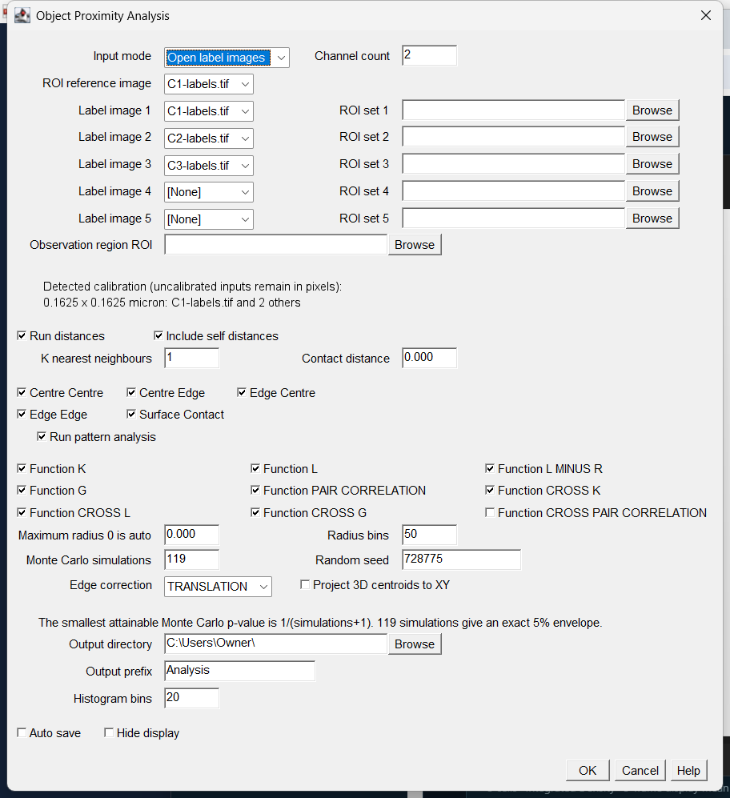

# Object Proximity Analysis

[](https://github.com/Jay2owe/ObjectProximityAnalysis/actions/workflows/build.yml)
[](LICENSE)
<!-- DOI badge: add once a release is archived on Zenodo. -->

Calibrated distances between segmented objects, and 2D spatial point-pattern
statistics with Monte Carlo significance tests, for ImageJ and Fiji.

It accepts label images or ImageJ ROI sets from any segmentation workflow;
segmentation is deliberately separate from analysis. Every directed pair of up
to five channels is measured centre to centre, centre to edge, edge to centre,
edge to edge and by surface contact, and each channel's centroids can be
tested against complete spatial randomness with Ripley's K and its relatives.

## Installation

### From the Fiji update site (recommended)

1. In Fiji, open `Help > Update...` and click **Manage Update Sites**.
2. Tick **Object-Proximities**, or add it with **Add Unlisted Site**
   and the URL `https://sites.imagej.net/Object-Proximities/`.
3. Click **Apply and Close**, then **Apply Changes**, and restart Fiji.

The update site is being set up; until it is live, install manually as below.

### Manually

Download `Object_Proximity_Analysis-<version>.jar` from the
[latest release](https://github.com/Jay2owe/ObjectProximityAnalysis/releases/latest),
copy it into Fiji's `plugins/` folder and restart Fiji. The jar is
self-contained: its engine is bundled inside it, so nothing else needs
installing.

## Requirements

- Fiji, or ImageJ 1.54 or later.
- Java 8 or later (Fiji's bundled Java is fine).
- No other plugins. Segment your images with any tool first.

## Usage

```text
Plugins > Object Proximity Analysis
Plugins > Object Proximity Analysis Batch...
```



The main dialog supports either open label images or `.zip`/`.roi` sets. ROI
input needs an open reference image for dimensions and calibration. Object ROIs
must not overlap; conversion reports both ROI labels and the first conflicting
pixel instead of overwriting an object. Each object ROI must be an area
selection, use an in-range Z position (or Z=0 for an unpositioned ROI), and
cover at least one in-bounds pixel.

### Calibration and observation window

The plugin displays detected voxel size in the dialog. An uncalibrated image is
reported in `pixel`, never silently in micrometres. The Java API can require
physical calibration with `requirePhysicalCalibration(true)`. Batch runs also
log a warning for every uncalibrated group and record it in the group manifest.

Point-pattern statistics require an observation window. The default is the full
XY image rectangle. An optional region ROI set supplies a calibrated rectangular
union bounding box; every region ROI must be an area selection.
Objects are included when their centroid lies
inside that window; objects crossing either the acquisition boundary or the
effective observation-window boundary are marked as edge objects.

## Macro

ImageJ's `GenericDialog` makes the command recordable:

```text
run("Object Proximity Analysis",
    "input_mode=[Open label images] channel_count=2 "
  + "label_image_1=A label_image_2=B "
  + "run_distances include_self_distances k_nearest_neighbours=1 "
  + "contact_distance=2 run_pattern_analysis "
  + "monte_carlo_simulations=119 random_seed=777 "
  + "edge_correction=TRANSLATION hide_display");
```

Important option names are:

| Group | Options |
|---|---|
| Input | `input_mode`, `channel_count`, `roi_reference_image`, `label_image_1`...`label_image_5`, `roi_set_1`...`roi_set_5`, `observation_region_roi` |
| Distances | `run_distances`, `include_self_distances`, `k_nearest_neighbours`, `contact_distance`, `centre_centre`, `centre_edge`, `edge_centre`, `edge_edge`, `surface_contact` |
| Pattern | `run_pattern_analysis`, `function_k`, `function_l`, `function_l_minus_r`, `function_g`, `function_pair_correlation`, `function_cross_k`, `function_cross_l`, `function_cross_g`, `function_cross_pair_correlation` (off by default), `maximum_radius_0_is_auto`, `radius_bins`, `monte_carlo_simulations`, `random_seed`, `edge_correction`, `project_3d_centroids_to_xy` |
| Output | `histogram_bins`, `auto_save`, `output_directory`, `output_prefix`, `hide_display` |

The smallest attainable Monte Carlo p-value is `1/(simulations+1)`. For example,
99 simulations cannot report a p-value below 0.01. The default of 119 gives an
exact 5% envelope; a recorded macro that omits `monte_carlo_simulations` uses it.
Pointwise envelopes are emitted only when all requested simulations contribute
at that radius. Curve tables record `Envelope_N` and `Envelope_Status` for each
radius; incomplete bounds are `NaN` without invalidating an otherwise complete
global rank test.
The cross-function null randomises both patterns independently, so a significant
cross-K, cross-L, or cross-G rejects "both patterns are complete spatial
randomness and independent of each other". It does not isolate dependence: a
clustered but genuinely independent pair can reject. Conditioning on the
observed marginal patterns, by random labelling or toroidal shifts, is not
implemented.

A radius where fewer than two of the observed and simulated curves are estimable
carries no comparative information and is excluded from the global
maximum-deviation statistic for every curve alike. A radius where every
estimable curve took the same value is excluded for the same reason: the
observed curve is exactly typical of the null there, however far the shared
value sits from the theoretical expectation. Nearest-neighbour G does this at
every radius past saturation at 1, and K and its derived curves do it at a
smallest radius closer than any pair in the pattern. Under border correction this
is what happens at radii larger than almost every point's distance to the window
boundary. `Radius_At_Maximum_Deviation` is therefore the radius at which the
ranked standardised statistic peaks, and `Maximum_Absolute_Deviation` is the raw
departure from the theoretical expectation at that same radius.

Pair correlation supports translation edge correction (or no edge correction).
Border correction is rejected because its risk-set weighting is not valid for
this pair-correlation estimator and can otherwise produce negative estimates.
Cross pair correlation carries the identical restriction: a rule that held for
g(r) but not for its A-to-B form would be worse than the restriction. It is the
ring-normalised derivative of cross-K, the same estimator family as the
univariate form, so the two can be read side by side.
Radii must be strictly increasing. The public K-to-pair-correlation helper also
rejects negative, infinite, or materially decreasing K values.

## Outputs

Auto-save writes:

```text
Object Proximity Analysis/
  Objects/
  Distributions/
  Curves/
  Folder/
```

Every subfolder contains a `README.txt`.
Batch aggregate runs are kept in identity-named subfolders below `Folder/`, so
rerunning a different input root or analysis shape cannot mix old and new
aggregate files.
Interactive runs display histogram and ECDF tables as well as per-object,
summary, centroid, pattern-curve, and provenance tables.

Pattern outputs carry separate radius and curve-value units: K is area, L is
length, and G/pair-correlation are dimensionless. Requests with too few points
are marked `INSUFFICIENT_POINTS` and return undefined values rather than
apparently valid zero curves. Batch aggregates keep incompatible units in
separate tables. A global rank is marked `INCOMPLETE_MONTE_CARLO` and its
p-value is undefined unless every requested simulation contributes a valid
curve.

Distance summaries always contain every requested mode and neighbour rank.
Empty or undersized inputs retain object counts and are marked
`NO_SOURCE_OBJECTS`, `NO_TARGET_OBJECTS`, `INSUFFICIENT_NEIGHBOURS`, or
`UNDEFINED_MEASUREMENTS` rather than disappearing from the output.
With one channel, requested cross-pattern functions receive explicit
`NOT_APPLICABLE_REQUIRES_TWO_CHANNELS` summary rows. Sample standard deviation
is undefined (`NaN`) when fewer than two measurements or groups contribute.

A one-channel run cannot request distances with self-distances disabled or
request only cross-pattern functions; the API rejects both configurations
instead of returning empty output.
Distance settings are validated only when distance analysis runs, and pattern
settings only when pattern analysis runs, so either half remains independently
usable.

## What it measures

- 1-5 channels, every directed channel pair, and optional self-channel analysis.
- Centre-centre, centre-edge, edge-centre, edge-edge, and surface-contact modes.
- First through k-th neighbours, partner labels, contact-threshold flags, and
  edge-object flags.
- Exact shared-face contact and thresholded surface apposition are separate
  outputs. In 2D these are lengths; in 3D they are areas.
- Ripley K, L, L(r)-r, nearest-neighbour G, pair correlation g(r), cross-K,
  cross-L, cross-G, and cross pair correlation g12(r).
  Cross pair correlation is **not selected by default**: it is another full
  pass per Monte Carlo simulation, so an existing run does not silently get
  slower. Tick `Function_CROSS_PAIR_CORRELATION`, or request it through the
  API, to include it.
- Translation or border edge correction for K and its derived curves. G and
  cross-G are uncorrected, so their `CSR_Expectation` column is the theoretical
  curve rather than an edge-corrected one; compare an observed G against the
  simulated envelope rather than against that column.
- Reproducible complete-spatial-randomness Monte Carlo envelopes with recorded
  seed, pointwise rank envelopes whose delivered level is reported (exactly 5%
  at the default 119 simulations), and an exchangeable global
  maximum-deviation Monte Carlo p-value.
- Per-object, summary, histogram, empirical cumulative distribution (ECDF), and
  curve tables.
- Folder batch grouping by regular expression, with preview, recursive scanning,
  mean curves, and mean ECDFs with between-group spread.
- Dialog-free Java API and ImageJ macro operation.

The first point-pattern implementation is 2D. A 3D label stack is rejected for
pattern analysis unless the caller explicitly requests XY centroid projection.
Distance measurements remain fully 3D.

## How it works

Each label image is read once into calibrated geometry: every object's
centroid, its voxels, and every exposed voxel face as a calibrated rectangle
(a line segment in 2D). Distances are measured between those faces and
centroids in physical units, so anisotropic voxels are handled exactly, and
for every source object the k nearest partners are kept in each requested
mode.

Point-pattern analysis works on the object centroids inside the observation
window. The observed curve is compared with curves from simulated patterns
that keep each channel's object count but place the objects uniformly at
random (independently per channel for cross functions). The pointwise
envelope is a rank envelope over those simulations, and the global p-value
ranks the observed curve's largest standardised departure among all of them.

### Measurement definitions

- Centre-edge is zero when the source centre lies inside the target object.
- Edge-centre is the directed reverse of centre-edge.
- Edge-edge is the exact minimum distance between calibrated voxel faces and is
  zero for touching or overlapping objects.
- Exact contact counts source boundary faces directly adjacent to the selected
  target label.
- Apposed surface counts source boundary faces within the chosen contact
  distance of an oppositely facing target surface. A face is counted whole once
  any part of it is within range, so two objects meeting only at a corner still
  contribute their full adjacent faces even at contact distance zero, where
  exact contact is correctly zero. Compare the two columns rather than reading
  apposed surface alone.
- Surface-contact partners are ranked by apposed surface measure, largest first.
  Distance modes are ranked smallest first.

Label images must contain positive integer object labels on a zero background.
Each input must contain one ImageJ channel and one time frame; split
multichannel or time-series data into separate label images first. All inputs
must have identical dimensions and voxel calibration. Duplicate image or API
channel names receive distinct effective names in every output. Multi-channel
analyses also require identical ImageJ X/Y/Z spatial origins; differing origins
are rejected rather than treating physically shifted channels as registered.
Centroids, inverse pixel lookups, default windows, and ROI-derived windows all
use `(pixel coordinate - spatial origin) × voxel size`.

### How long a run takes

Distances are exact, but only the pairs that can still be among the k nearest
are measured face by face: each object's bounding box gives an exact lower
bound on its distance, so the search stops as soon as no remaining object can
compete. Point-pattern K is computed at every radius in one pass over the
pairs. Pattern analysis still grows with the square of the object count and
the number of simulations, and is the slow half of a large run. Press Escape
to stop a run at any time.

Measured on seeded synthetic scenes (default settings: all five distance modes
with k = 3, or the seven default pattern functions with 119 simulations and 50
radii), median of three runs, on a laptop with an AMD Ryzen 7 7730U (8 cores,
16 threads), Java 21 and a 4 GB heap:

| Scene | Objects (both channels) | 0.3.0 | 0.4.0 | Faster by |
|---|---|---|---|---|
| 2D discs, radius 4 px, 1024 x 1024 | 200 | 0.5 s | 0.2 s | 2.2x |
| 2D discs, radius 4 px, 1024 x 1024 | 800 | 4.6 s | 0.4 s | 10x |
| 2D discs, radius 4 px, 1024 x 1024 | 3,200 | 63 s | 3.1 s | 21x |
| 3D balls, radius 5 voxels, 256 x 256 x 48 | 100 | 14 s | 2.4 s | 5.7x |
| 3D balls, radius 5 voxels, 256 x 256 x 48 | 200 | 49 s | 4.6 s | 11x |
| 3D balls, radius 5 voxels, 256 x 256 x 48 | 400 | 2.8 min | 9.5 s | 18x |
| 2D points, 2048 x 2048, 7 functions, 119 simulations | 400 | 1.8 s | 0.4 s | 4.7x |
| 2D points, 2048 x 2048, 7 functions, 119 simulations | 2,000 | 41 s | 5.6 s | 7.3x |
| 2D points, 2048 x 2048, 7 functions, 119 simulations | 10,000 | not finished at 3.5 h | not finished at 98 min | |

Every output of 0.4.0 is identical, bit for bit, to 0.3.0's on these scenes.
Setting `opa.parallelism=1` (the serial path) is 4 to 6 times slower for
pattern analysis. Peak heap stayed under 450 MB in every case above.

Label images are held as one `int` per voxel regardless of input bit depth, plus
roughly 400 bytes per labelled voxel of extracted geometry. A 2048 x 2048 x 100
stack with five per cent of voxels labelled therefore needs several gigabytes;
raise Fiji's memory in `Edit > Options > Memory & Threads` or crop first. Inputs
above 2,147,483,647 voxels are rejected outright.

### Parallel execution

Independent source-object distance calculations and Monte Carlo simulations
run in parallel, with a default cap of eight workers. Monte Carlo point
patterns are still generated from the original seeded random stream on the
coordinator, so worker completion order cannot change scientific results.
Set the JVM system property `opa.parallelism` to a positive integer to
override the cap, or to `1` to use the serial reference path.

## Validation

Every point-pattern function here has been checked against
[spatstat](https://spatstat.org/), the reference implementation in R, on twelve
fixed patterns covering complete spatial randomness at three densities, a
cluster process, a jittered grid, an elongated window, a window whose origin is
not at the pixel origin, and four bivariate pairs.

Ripley K, L, L(r)−r, cross-K and cross-L agree to within 1e-15 relative under
both translation correction and no correction. Nearest-neighbour G and cross-G
agree exactly, bit for bit. The pointwise Monte Carlo envelope and the global
p-value have been separately calibrated over 1,000 randomised patterns.

A one-page summary of every validation stage, with links to the full
findings, is in [`docs/VALIDATION.md`](docs/VALIDATION.md).

### The border correction differs from spatstat, deliberately

If you cross-check this plugin against spatstat you will find border-corrected
K larger by a factor of n/(n−1) — about 2% at 50 objects, 0.2% at 500. Neither
tool is wrong; they estimate the density term differently.

A point cannot be its own neighbour. When the number of objects is fixed, which
is exactly what this plugin's randomisation does in every simulation, an
interior object expects (n−1)·πr²/|W| neighbours. Dividing by (n−1), as this
plugin does, is then unbiased. spatstat divides by n, which is the standard
choice when the number of points is itself random.

Measured over 3,000 randomised patterns against the analytic πr², this plugin's
mean absolute bias is 1.06% at 50 objects and 0.36% at 200, against 2.99% and
0.86% for the other convention. The choice here is the one matched to the null
model the plugin actually simulates.

Translation correction is the default and is unaffected. Use it unless you have
a specific reason not to.

### Nearest-neighbour radii can saturate

G and cross-G are cumulative distributions: they climb to 1 and stop. Once
almost every object already has a neighbour within r, every randomised curve
takes the same value there, the envelope collapses to a point, and nothing can
fall outside it. Those radii are not evidence of randomness — they are empty.

The plugin warns when requested radii pass the point at which the expected
curve reaches 99% of its maximum, reports `Saturation_Radius`,
`Saturated_Radii` and `Saturation_Status` in the pattern summary, and flags
individual radii with a `Saturated` column in the curve tables.

**It warns rather than silently capping the radius range**, because quietly
changing what you asked for is worse than telling you it will not help. If you
see the warning, either shorten the radius range or read those radii as
carrying no information.

## Java API

The core call opens no dialogs, shows no windows, and writes no files:

```java
OPAParameters parameters = OPAParameters.builder(labelA, labelB)
        .neighborCount(3)
        .contactDistance(2.0)
        .simulations(999)
        .seed(12345L)
        .progressListener((fraction, message) -> {
            // Update a calling application's status display if desired.
        })
        .build();

OPAResult result = OPA.run(parameters);
```

`OPAResult.getCentroidTables()` returns the filtered centroid lists actually
used by pattern analysis. `getProvenanceTable()` records calibration, effective
observation-window bounds, edge correction, projection, seed, contact
threshold, requested analysis settings, and the radii actually used after
automatic or maximum-radius resolution. The provenance table is shown for both
distance and pattern runs.

Whole-number dialog fields reject fractional and out-of-range values instead of
truncating them. Resource limits are 1,000 neighbours, 10,000 histogram bins,
10,000 radius bins, and 10,000 simulations, with at most 10,000,000 stored
simulation-radius values in one Monte Carlo analysis.

ROI conversion is also dialog-free:

```java
ImagePlus labels = OPALabelImages.fromRoiSet(reference, "cells.zip");
```

Saving is explicit:

```java
OPAOutput.save(result, outputFolder, "Sample_01");
```

Folder batch:

```java
OPAParameters options = OPAParameters.builder()
        .simulations(999)
        .seed(12345L)
        .build();

OPABatchParameters batch = OPABatchParameters.builder(
                inputFolder, "(sample\\d+)_([^_]+)\\.tif", 2)
        .analysisTemplate(options)
        .recursive(true)
        .outputDirectory(outputFolder)
        .build();

String preview = OPABatchRunner.preview(batch);
OPABatchResult result = OPABatchRunner.run(batch);
```

The batch dialog and recorded macro expose the same distance modes, pattern
functions, and histogram-bin setting as the main analysis dialog.
The selected capture group is the channel name. Replacing that group with `*`
forms the sample group, so `sample1_A.tif` and `sample1_B.tif` run together.
If an optional capture group is unmatched for a filename, that file is retained
as an explicitly invalid group in the preview and manifest.
Saved batch prefixes include a lossless group-identity token, preventing groups
whose human-readable names are similar from overwriting one another. Aggregate
summary rows include the raw `Group_Identity`. Mean curves are linearly
interpolated onto a common grid over the radius range shared by every group;
`Group_N` therefore represents the number of contributing curves at every
reported radius. Aggregate filenames include a SHA-256 identity digest so
different raw units or names cannot collide after filename sanitisation.
Curve and distribution tables also carry raw source, target, function, mode,
and rank fields. Batch aggregation uses those raw fields rather than sanitised
display names. The preview marks groups that cannot run under the selected
analysis options. A group is added to summaries and aggregates only after its
required per-group save succeeds; batch-level aggregate-save errors are
reported separately and do not inflate the failed-group count.
Captured channel names are trimmed once before grouping, while their original
text and input filenames remain in the saved group manifest. Long output names
use bounded readable stems plus SHA-256 identity digests. Pressing Escape stops
geometry extraction, distance and surface calculations, or Monte Carlo work,
sets `OPABatchResult.isCancelled()`, marks unprocessed groups
as `CANCELLED`, and writes `Status: CANCELLED` into partial batch output.
Fiji progress updates continue within each Monte Carlo analysis, including
single-group batches.
Every user-supplied save prefix gains a SHA-256 identity digest, so names that
differ only by punctuation or case cannot overwrite each other on Windows.
The digest also includes the exact output shape; reusing a prefix for a run
with different requested tables creates a distinct run identity instead of
leaving obsolete files under the current identity.
CSV output writes the full stored double value rather than ImageJ's rounded
display form. The group manifest records non-OK distance or pattern statuses
in `Analysis_Warnings`. A complete table set is staged before publication, and
each final CSV or README replaces its predecessor with a same-directory atomic
move, so a failed write does not truncate the prior valid file.

## Build

OPA builds against two core modules, neither of which a user ever installs:

- `oc3d-core` 0.1.0 — shared recursive regular-expression batch discovery.
- `opa-core` 0.4.0 — OPA's own engine: label geometry, the distance measures,
  and the 2D point-pattern statistics with their Monte Carlo null. It is
  extracted so other plugins can embed the engine without requiring OPA to be
  installed.

Neither is published to a Maven repository, so install both pinned source
releases into the local Maven repository before building OPA:

```text
git clone --branch v0.1.0 https://github.com/Jay2owe/oc3d-core
git clone --branch v0.4.0 https://github.com/Jay2owe/opa-core
mvn -f oc3d-core/pom.xml clean install
mvn -f opa-core/pom.xml clean install
```

macOS/Linux:

```text
./mvnw clean verify
```

Windows:

```text
mvnw.cmd clean verify
```

The packaged JAR is written to `target/Object_Proximity_Analysis-<version>.jar`.
It contains only the core classes OPA actually reaches, relocated under
`opa.internal.core` (`oc3d-core`) and `opa.internal.engine` (`opa-core`); users
install this one JAR and do not install either core. The two cores get separate
relocation roots so a stale copy of one cannot stand in for the other. The
integration test asserts that no `sc.fiji.*` package and no `ij/` entry survives
in the packaged JAR, and that the engine loads from it with nothing on the
classpath but ImageJ.
The JAR is forced to rebuild during `package`/`verify` so its manifest cannot
retain stale source-control commit metadata after a new commit. It includes the
BSD 3-Clause licence at `META-INF/LICENSE`. The post-package integration test
byte-compares that entry with `LICENSE` and checks the manifest commit against
Git HEAD; continuous integration runs the full `clean verify` lifecycle. It
also checks that the manifest has no `Class-Path` line.

### GUI checks (need a screen)

These cannot run headless. They are automated by the maintainers' GUI
harness, which is kept outside this repository (`_gui/run-gui.sh opa` in the
release workspace). It starts a non-headless Fiji with the built jar on a
1536 x 864 screen, drives the real dialogs from a Groovy script (menu commands,
field values, button presses, the Macro Recorder, Escape key events), saves a
screenshot of every dialog and writes PASS/FAIL per check. Last run: 0.4.1,
2026-09-30, all 14 pass (0.4.0 passed 2 of 14; its failures are the 0.4.1
fixes in the changelog). Run it, or tick by hand in a GUI Fiji, before a
release:

- [x] With no image open, `Plugins > Object Proximity Analysis` asks for a
      label image and records nothing.
- [x] The dialog lists `[None]` and every open image, shows the calibration
      and the Monte Carlo hint, fits a 1536 x 864 screen, and Cancel or Escape
      leave no window and no Recorder line.
- [x] At ImageJ GUI scale 1.5 both dialogs fit the screen with OK reachable.
- [x] With `Plugins > Macros > Record...` open, a 2D run (distances, all
      pattern functions, observation region), a 3D distances run and an ROI-set
      run each record one `run("Object Proximity Analysis", "...")` line that
      replays to byte-identical CSVs.
- [x] Result windows: every saved table is shown with a readable title, and
      each L(r)-r plot draws the envelope, the CSR line and the observed curve
      with micron axes, a y axis that holds the whole observed curve, and a
      readable envelope label in the legend.
- [x] Chance envelope: the pattern summary reports the simulation count,
      `Minimum_Achievable_P` = 1/(n+1), and global p-values no smaller than it.
- [x] 3D pattern analysis without XY projection gives a message; with
      projection it runs.
- [x] Wrong input gives a one-line message, no exception window and no
      Recorder line: RGB, non-integer float, two-channel image, size
      mismatch, the same image twice, `[None]`, a missing or absent ROI set, a
      ROI set beyond the channel count, a non-numeric seed, pair correlation
      with border correction.
- [x] Escape during the Monte Carlo simulations stops the run within 2 s with
      the status `Object Proximity Analysis cancelled`, the progress bar
      cleared, no result windows or files and no Recorder line; the next run
      is not cancelled.
- [x] `Plugins > Object Proximity Analysis Batch...` previews every sample
      (`.tif` and `.TIF`); Back returns to the settings with the values
      entered; Run batch shows the manifest and summary tables; the recorded
      line replays to identical output.
- [x] Cancel in the batch preview, or a folder that does not exist, stops
      cleanly with no files and no Recorder line.
- [x] Escape during a batch stops it within 3 s, marks the remaining groups
      `CANCELLED` and logs the cancel once.

## Citing

If you use Object Proximity Analysis in published work, please cite the
software release you used. GitHub's **Cite this repository** button gives the
citation from [`CITATION.cff`](CITATION.cff):

> Malcolm, J. (2026). *Object Proximity Analysis* (Version 0.4.1) [Computer
> software]. https://github.com/Jay2owe/ObjectProximityAnalysis

If you compare point patterns, please also cite the reference implementation
the estimators were validated against:

> Baddeley, A., Rubak, E. and Turner, R. (2015). *Spatial Point Patterns:
> Methodology and Applications with R*. Chapman and Hall/CRC.

## Acknowledgements

Developed by Jamie Malcolm in the [Brancaccio Lab](https://www.ukdri.ac.uk/labs/brancaccio-lab)
at the [UK Dementia Research Institute](https://ukdri.ac.uk/centres/imperial),
Imperial College London.

This work was supported by the UK Dementia Research Institute,
which receives its core funding from the UK Medical Research Council,
the Alzheimer's Society, and Alzheimer's Research UK.

Built on the [Fiji](https://fiji.sc/) / [ImageJ](https://imagej.net/)
ecosystem; we thank the SciJava community for the platform.

## Licence

BSD 3-Clause; see [`LICENSE`](LICENSE), with attribution in [`NOTICE`](NOTICE).
Both ship inside the jar under `META-INF/`.
